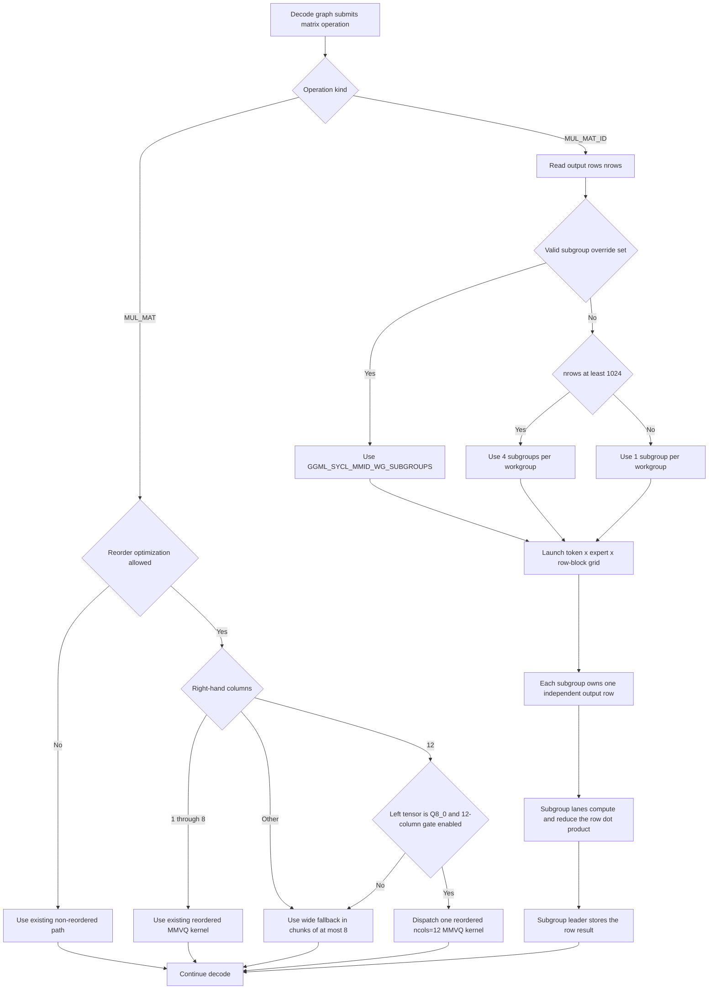
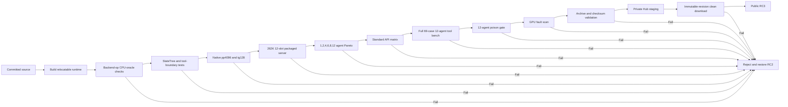

# Treebeard SYCL agent-serving dispatch

This note describes the two decode-path changes in commit `0424f677f`. The
target is the fixed 262144-context, 12-slot Qwen3.6 35B A3B serving profile on
an Intel Arc Pro B70. The optimization does not change quantization, routing
IDs, accumulation order within a subgroup, or output tensor layout.

## Runtime flowchart



Text fallback:

```text
decode operation
|-- MUL_MAT
|   |-- reorder unavailable ----------------------> existing path
|   |-- ncols 1..8 -------------------------------> existing reordered MMVQ
|   |-- ncols 12 + Q8_0 + gate enabled ----------> one 12-column MMVQ launch
|   `-- otherwise --------------------------------> wide 8-column chunks
`-- MUL_MAT_ID
    |-- valid subgroup override ------------------> requested subgroup count
    |-- nrows >= 1024 ----------------------------> 4 subgroups/workgroup
    `-- nrows < 1024 -----------------------------> 1 subgroup/workgroup
        `-- each subgroup computes one output row -> subgroup leader stores
```

## Work mapping

For fused MoE matrix-vector work, let `S` be the selected number of subgroups
per workgroup and let the hardware subgroup width be 32. The launch uses:

```text
global groups = (tokens, experts-or-groups, ceil(nrows / S))
local range   = (1, 1, S * 32)
row           = group_z * S + subgroup_linear_id
```

The old launch represented independent output rows through a second local
dimension. The new launch packs those rows as independent subgroups in the
third local dimension. All lane-local block traversal, XOR reduction, and
leader-only store behavior remain subgroup-scoped. The mapping is shared by
the plain, reordered, and grouped-reordered `MUL_MAT_ID` kernels.

The automatic policy keeps a single subgroup for smaller projections and uses
four for projections with at least 1024 output rows. Four was selected by
matched parent/candidate controls at the release serving shape. Larger values
remain available for controlled experiments but are not the automatic path.

## Control gates

| Variable | Meaning |
| --- | --- |
| `GGML_SYCL_DISABLE_MMVQ_12COL=1` | Disable direct Q8_0 12-column reorder and use the wide fallback. |
| `GGML_SYCL_MMID_WG_SUBGROUPS=1` | Reproduce the prior one-row-per-workgroup MMID geometry. |
| `GGML_SYCL_MMID_WG_SUBGROUPS=2,4,8,16,32` | Force an experimental packed subgroup count. |

Unset or zero `GGML_SYCL_MMID_WG_SUBGROUPS` selects the automatic 1-or-4
policy. Any unsupported value also falls back to automatic selection.

## Correctness invariants

- The 12-column fast path is restricted to reordered Q8_0 weights.
- Shapes outside the exact eligibility checks retain the existing fallback.
- Each MMID subgroup owns one output row; no row is shared by subgroups.
- Routing IDs and token/expert addressing are unchanged.
- Bounds checks still suppress the tail rows in the last row block.
- Reduction and storage remain subgroup-local and leader-only.
- Both optimizations have environment controls for same-binary attribution.

## Release-gate flowchart



The benchmark service uses isolated port 8098. Production RC2 on port 8093 is
never used for inference during the gate and is restored and attested on every
exit path.
